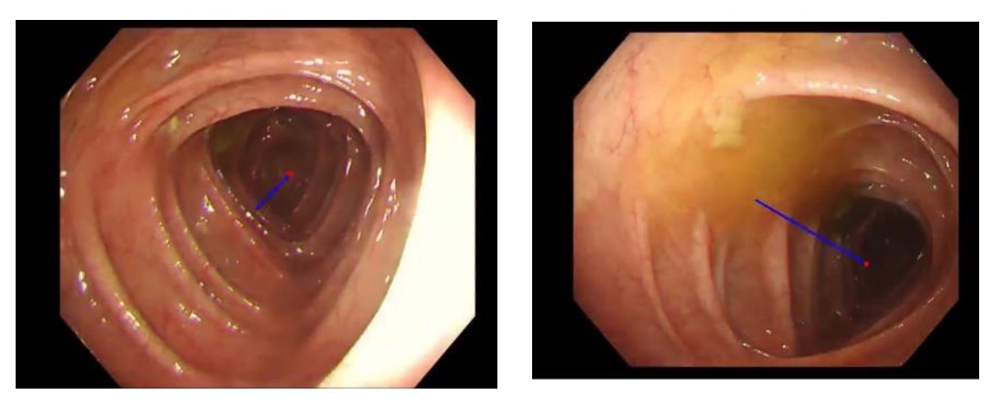
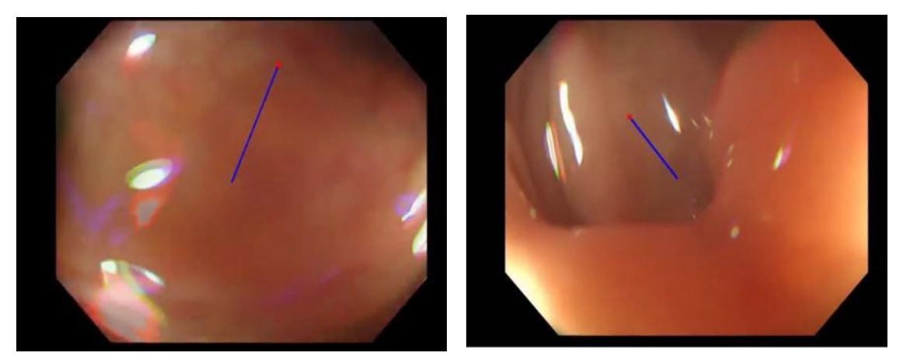

# AI-Assisted Colonoscopy Navigation — Predicting Insertion Direction
### Introduction/Project Aim

Colonoscopy is a vital tool in the early detection and diagnosis of colorectal diseases. However, navigating the colonoscope through the complex, curved, and often poorly visualized intestinal tract remains a major challenge. During insertion, physicians often face ambiguous views, sharp bends, and limited visibility, increasing procedure time, patient discomfort, and the risk of complications. To address these challenges, we propose an AI-assisted navigation system for colonoscopy, aimed at predicting the optimal insertion direction based on real-time endoscopic imagery.This system leverages deep learning and image processing techniques to analyze colonoscopic video frames and assist clinicians in guiding the scope more efficiently and safely. 

### Previous Work
Despite the anatomical complexity of the gastrointestinal (GI) tract, its relatively large lumen and good visibility have encouraged extensive global research into autonomous visual navigation methods for endoscopy. Prior work mainly falls into two categories:
(1) Dark region and optical flow-based approaches, which identify the darkest or deepest regions in an image as a proxy for the lumen center [1–9].
These methods are simple to implement, and many studies have explored segmenting dark areas or estimating 3D depth using shadows or light gradients. However, they share a fundamental limitation: the assumption that the darkest point always represents the optimal forward direction. In reality, this assumption is easily disrupted by lighting conditions, camera focus, and tissue geometry. Most of these methods ignore endoscope size and surrounding anatomy, which often leads to suboptimal navigation—especially in curved or complex sections of the colon. While the darkest region may align well in straight segments like the descending colon, it fails in tortuous or occluded areas where proper alignment requires more anatomical awareness.
(2) Lumen centralization methods based on anatomical features, such as haustral folds or lumen contours.
These methods often offer more reliable direction cues, as visible structures like folds are typically closer to the endoscope and better reflect the actual lumen path. However, such features are not always visible—especially in occluded views or sharp turns where the scope directly faces the colon wall.
Overall, a robust navigation algorithm must adapt to highly variable anatomical environments and be resilient across patients, accommodating both visual clarity and structural occlusions during insertion.

### Our Method
To address the complexity and variability of the gastrointestinal environment, we propose a navigation method that predicts the insertion direction by combining lumen image classification with both dark-region analysis and haustral fold-based tracking. Our system consists of three key components: a lumen image classifier, a dark-region-based lumen center estimator, and a fold-based lumen tracking algorithm. The process begins by classifying each frame into two categories based on visual features: images with clear haustral folds are routed to the fold-based algorithm, while those showing ambiguous or poorly structured regions (e.g., sharp turns or occlusions) are processed using the dark-region method. This adaptive framework allows the system to select the most suitable strategy based on the current visual context, improving the accuracy and robustness of lumen center detection and forward direction prediction during colonoscope insertion.

#### Dark Region Method 
For images routed to the dark region method, we assume that the forward direction corresponds to the darkest area within the lumen. The process begins by enhancing contrast using the red channel of the RGB image, which is particularly effective in colonoscopy for highlighting light and dark regions. Noise is reduced using Gaussian and median filters. The image is then downsampled by 50% and converted to grayscale to reduce computational cost. A histogram-based analysis identifies a valley point to separate bright (non-lumen) and dark (lumen) areas, followed by adaptive thresholding to create a binary image—dark regions are marked as lumen, bright as wall. Morphological operations (e.g., closing, denoising, edge smoothing) refine the segmentation. Contours are extracted using methods like OpenCV’s findContours, then smoothed (e.g., with spline interpolation) to define lumen boundaries. Finally, the contours are overlaid on the original image to verify accuracy and guide forward direction estimation.

### Applying on the Video
Colonoscopy Video Preprocessing and Lumen Center Extraction
Preliminary preprocessing was performed on the provided colonoscopy video data. A large number of invalid frames—such as those at the beginning or end of the video, frames that were blurry, completely black, or heavily overexposed—were removed. Background pixels were also filtered out. Valid frame segments were selected, and the full video was sliced into short clips of 200 frames each.
The dark-region method was applied to automatically estimate the lumen center in each frame.
This method performed well in regions with clear tissue structures and strong light–dark contrast, but its performance was limited in areas filled with fluid or lacking sufficient contrast between the lumen and colon wall.
Further optimization of the estimation process awaits feedback from clinical experts.

#### Haustral Folds Method
Haustral Fold-Based Method
This method targets images with visible haustral folds to estimate the lumen center through shape-based analysis. First, each 640×480 colonoscopy image undergoes grayscale conversion, followed by Contrast Limited Adaptive Histogram Equalization (CLAHE) over 12×12 tiles to enhance contrast, and Gaussian filtering to smooth noise. Next, Canny edge detection is applied to identify haustral fold contours (O-rings), using relaxed parameters to maximize detection. Small fragments below a preset pixel threshold (e.g., 500 pixels) are discarded to filter out noise. The remaining fold segments are individually labeled with IDs and pixel data, allowing for multiple candidates in a single frame. Each segment is then evaluated for ellipse fitting; those failing to form valid ellipses are excluded. Finally, the centroid of the fitted ellipse is calculated and used as the predicted lumen center for navigation guidance.

### Deep Learning Imrovement
The current deep learning models and related papers on medical image segmentation and edge recognition are collected and organized, and the applicability of the related models in edge detection and closed structure extraction is preliminarily evaluated. We will focus on MedSam based models for improving segmentation accuracy and apply U-Net as a baseline model for comparison.

